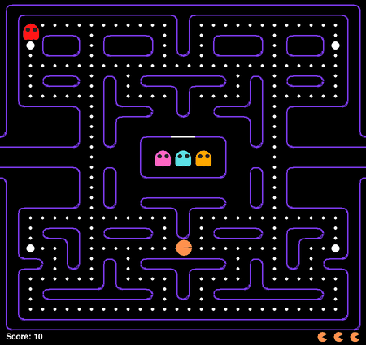
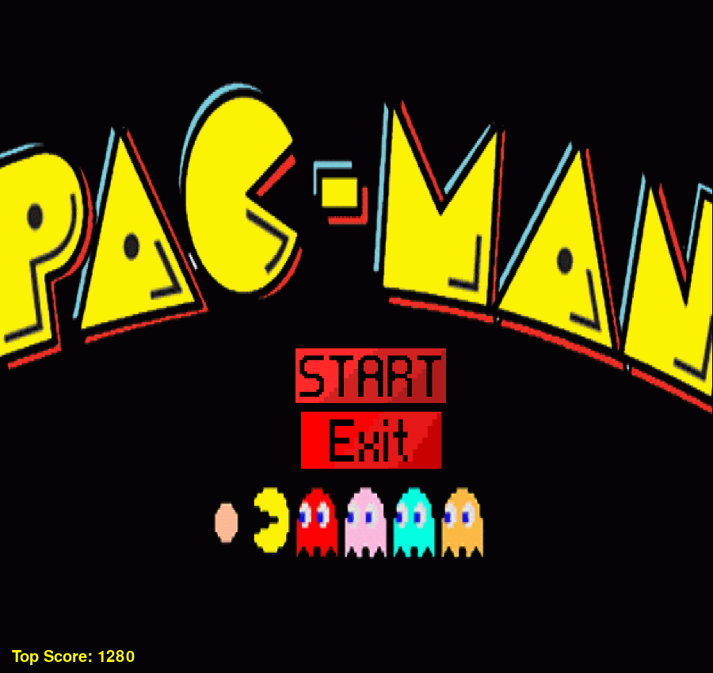
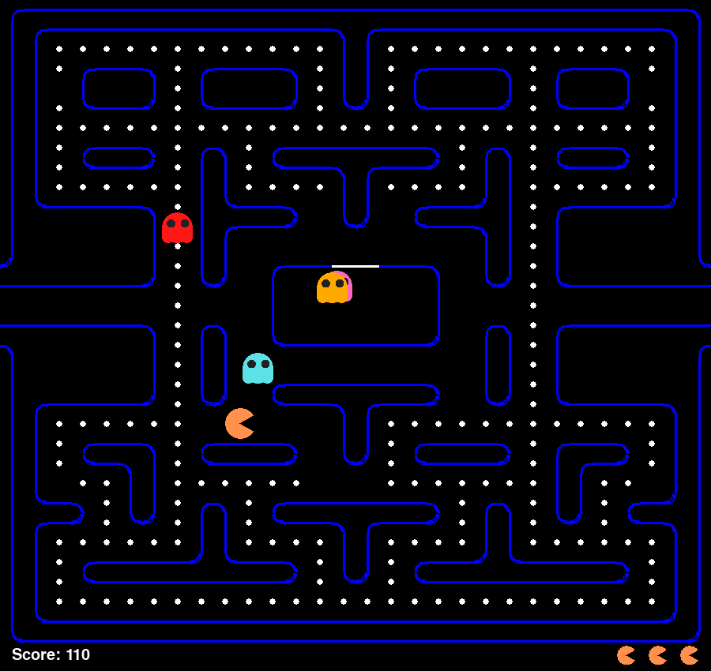

# 🟡 Pacman Game

A classic Pac-Man clone written in **Python** with **Pygame**. It has four ghosts with their own movement rules, power pellets, and a high-score table stored in **SQLite**.

<div align="center">
  
</div>

## ✨ Features

- **Classic maze** drawn from a tile grid (`board.py`), with tunnels on both sides that wrap you to the other edge
- **Four ghosts with their own behaviour:** Blinky, Pinky, Inky and Clyde use different turning rules and escape routes, and leave the ghost box on their own
- **Power pellets:** ghosts turn blue and run away for about 10 seconds. Eaten ghosts return to the box as eyes and come back out
- **Scoring:** 10 points per dot, 50 per power pellet, 300 per ghost
- **3 lives**, plus game-over and win states. Press `Space` to play again
- **Persistent high score:** each finished game is saved to `Score.db` (SQLite), and the best score is shown in the main menu
- **Start menu** with image buttons

## 🎮 Controls

| Key | Action |
| --- | --- |
| `←` `→` `↑` `↓` | Move / queue the next turn |
| `Space` | Restart after game over or a win (saves your score) |

## 🚀 Getting Started

Requirements: **Python 3.8+** and **Pygame 2**. `sqlite3` is part of the Python standard library.

```bash
git clone https://github.com/ibrahimyankac/Pacman-Game.git
cd Pacman-Game
pip install pygame
cd pacman
python pacman.py
```

> Run the game from inside the `pacman` folder so the `assets/` images and `Score.db` are found.

## 🖼️ Screenshots

<table>
  <tr>
    <td width="50%"></td>
    <td width="50%"></td>
  </tr>
</table>

## 📁 Project Structure

```
pacman/
├─ pacman.py        # Game loop, player movement, ghost AI, collisions, scoring and SQLite high scores
├─ board.py         # Maze layout as a tile grid
├─ menu.py          # Reusable image button for the start menu
├─ Score.db         # SQLite database with past scores
└─ assets/
   ├─ player_images/   # Pac-Man animation frames
   ├─ ghost_images/    # Ghost, frightened and eaten sprites
   └─ menu_images/     # Menu background and buttons
```

## 🧠 How the ghosts think

Each frame, `get_targets()` gives every ghost a target:

- **Chase:** all four ghosts target Pac-Man. A ghost still inside the box heads for the exit first.
- **Frightened** (power pellet active): each ghost runs away in its own way. Blinky heads for the corner farthest from Pac-Man, Inky flees horizontally, Pinky flees vertically and Clyde retreats to the middle of the maze.
- **Eaten:** the ghost heads back to the ghost box, revives there and comes back out.

How each ghost reaches its target is what gives it a personality. `move_blinky`, `move_inky`, `move_pinky` and `move_clyde` each decide differently when the ghost may change direction at a junction.

## 🙏 Credits

Based on [LeMaster Tech](https://www.youtube.com/@lemastertech)'s Pygame Pac-Man tutorial, extended with a start menu and a SQLite high-score table.